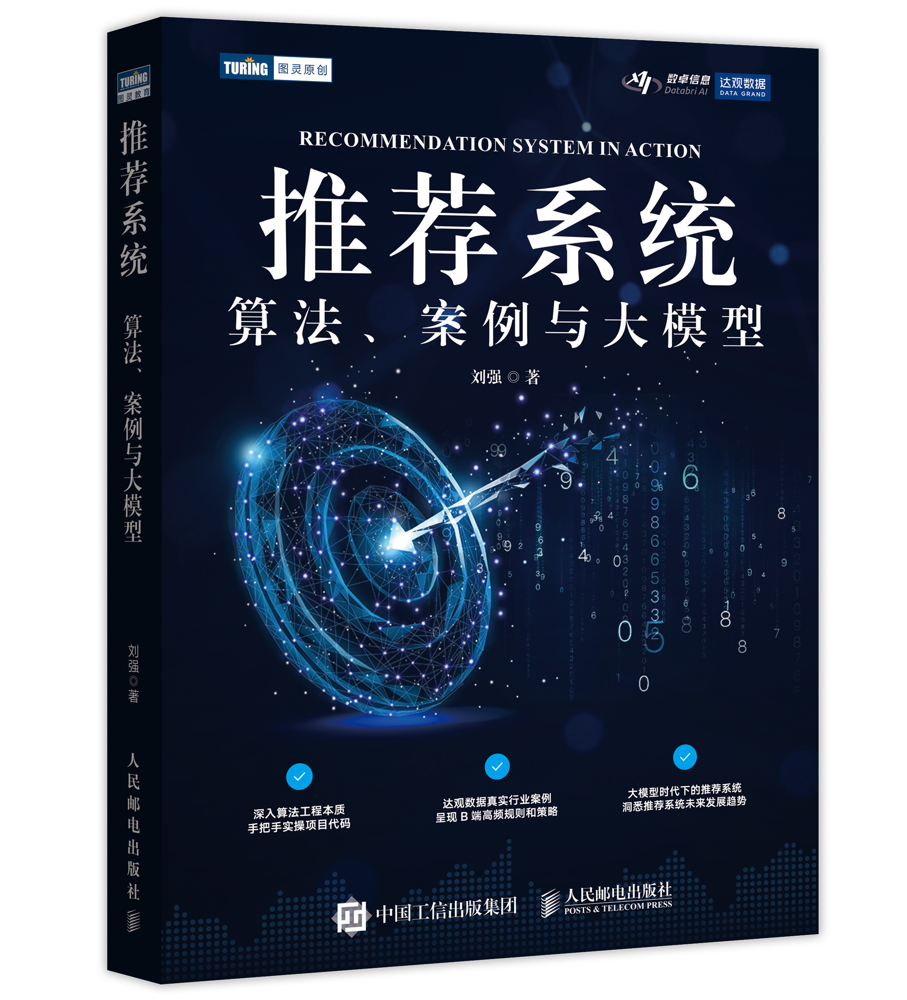
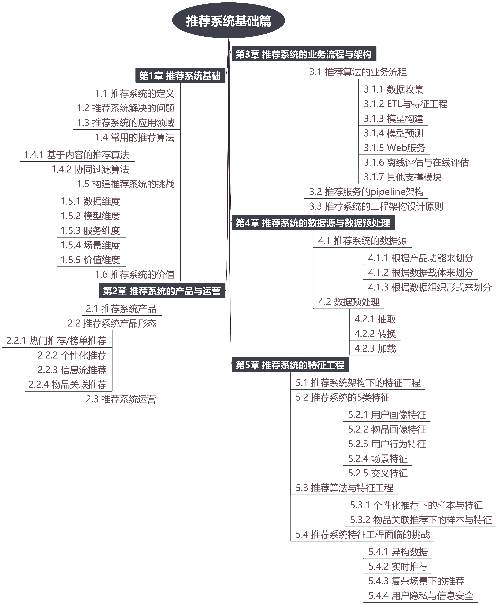
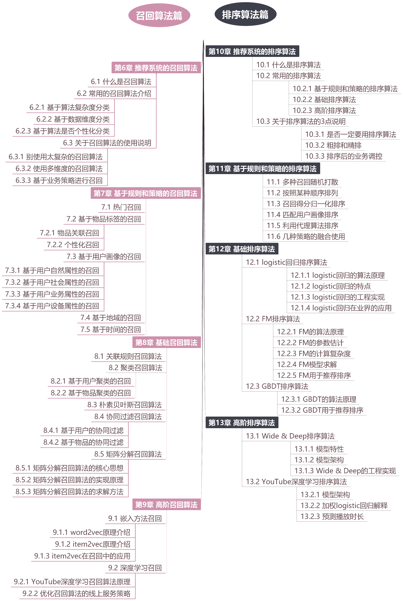
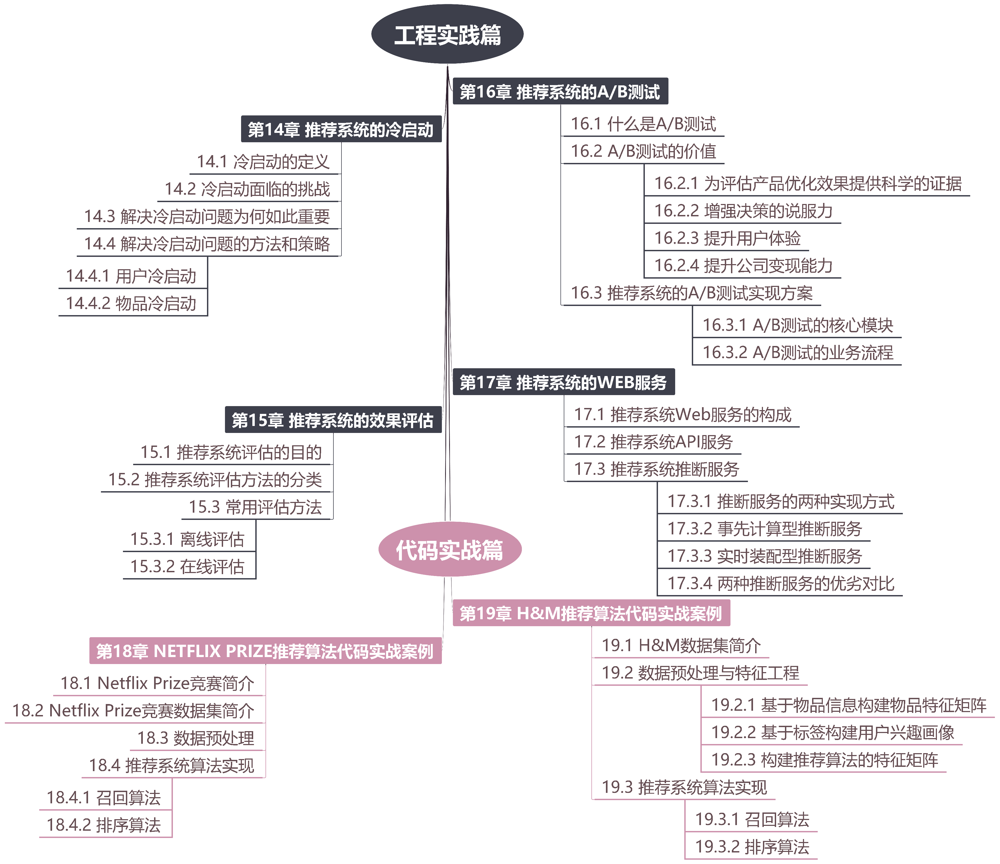
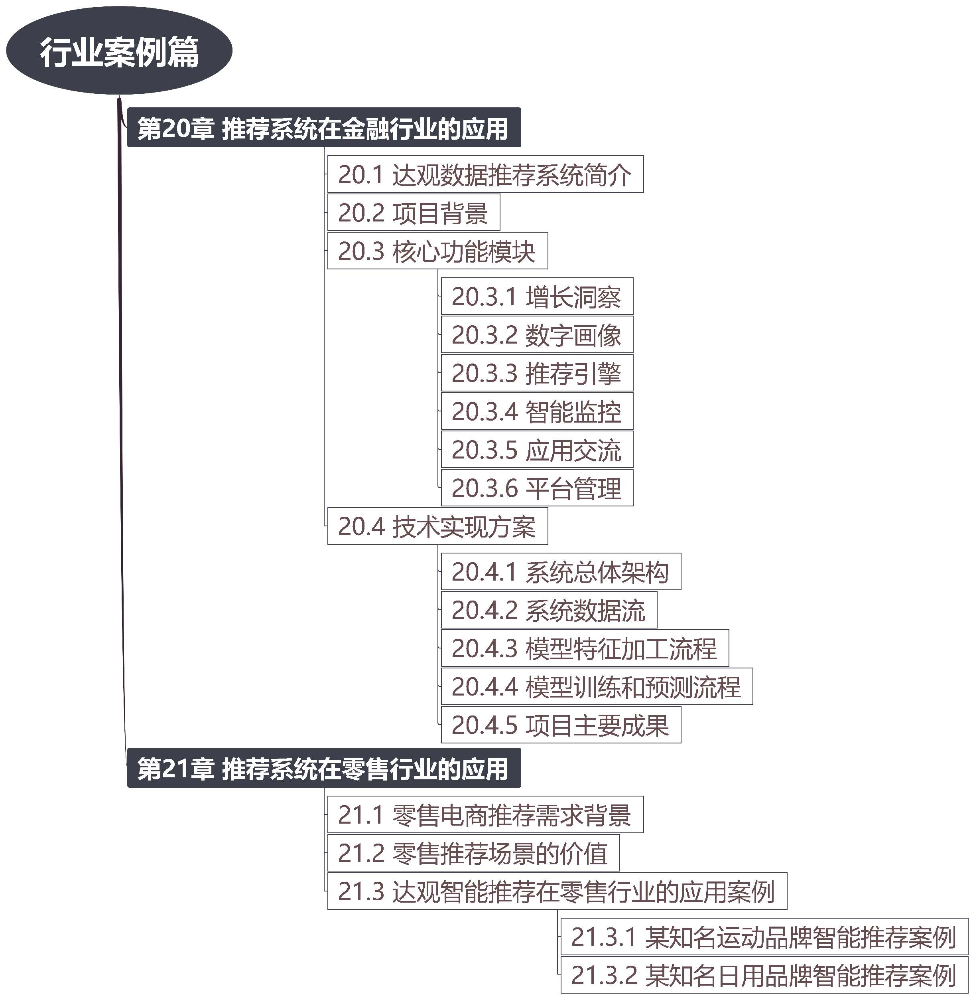
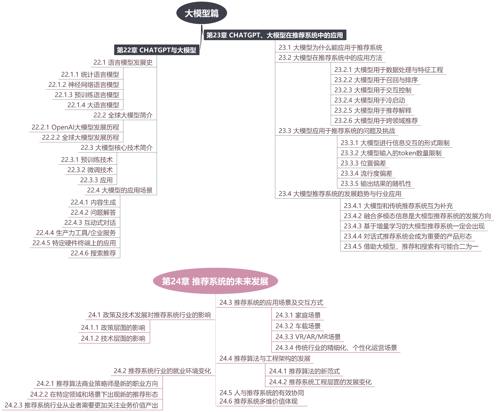

# recommender_systems_abc

本项目由**杭州数卓信息技术有限公司开发**。

为了帮助读者更好地学习**推荐系统**，我们编写了本代码，帮助读者更好地学习和实践推荐系统在企业的应用方法和思路。

本代码是跟图书和在线课程(免费)配套的学习资源，读者可以选择购买。

## 1. 配套图书

本项目跟作者最新出版（2024年4月，邮电出版社图灵原创）的专著《推荐系统：算法、案例与大模型》配套使用，是书中讲解案例的代码实现。

京东购买链接：https://item.jd.com/14529516.html

### 图书目录

## 2. 配套在线课程
在线课程链接：http://mp.weixin.qq.com/mp/homepage?__biz=Mzk0MzE3MDEyNQ==&hid=21&sn=022bef5f1603f437e8c838cb6fadb240&scene=18#wechat_redirect

## 3. 支持
如果觉得我们的代码对你有帮助，可以给我们打赏，谢谢！

